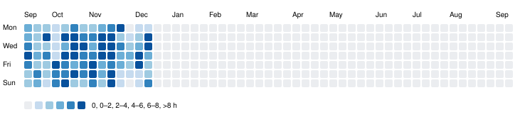

<!-- 顶部 Banner -->

  

<!-- 打字机效果 -->

  <a href="https://git.io/typing-svg">

## 🔬 About Me
  

  <a href="https://umep-lab.github.io">Website</a> ·
  <a href="mailto:chunhou.ji@your-domain.com">Email</a> ·
  <a href="https://scholar.google.com/citations?user=YOUR_ID">Google Scholar</a> ·

## 🛠️ Tech Stack

  
  
  
  
  
  
  

---

## 🚀 Featured Projects
- **MobilityAgentSociety** — LLM-driven multi-agent simulation for urban mobility  
- **TrajSceneLLM** — Narrative-driven synthetic trajectory generation  
- **DailyMobility Benchmark** — Evaluation suite for activity/travel generation  
- **UMEP Lab Website** — Astro + Tailwind (🔗 umep-lab.github.io)

---

## 🐍 Contribution Snake

  <picture>
    <source media="(prefers-color-scheme: dark)" srcset="https://raw.githubusercontent.com/februarysea/februarysea/output/github-contribution-grid-snake-dark.svg">
    
  </picture>

---
### My Work Hours Wall

  

